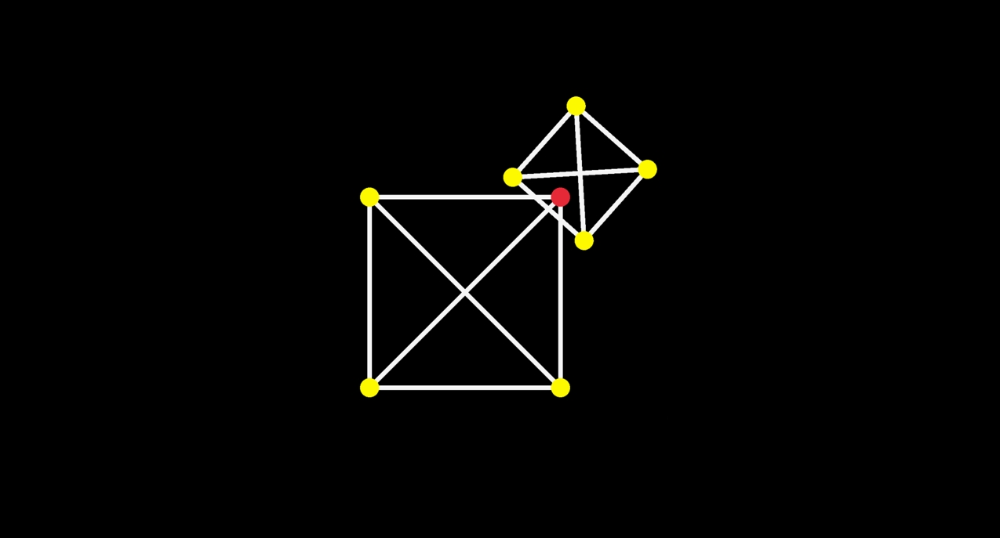

# Enjhin

Soft body physics engine in C using [raylib](https://github.com/raysan5/raylib)  
If you want to see the development in action check out my stream on twitch <https://twitch.tv/datuchela>  
I have already done similar thing in [web](https://fizziks-engine.netlify.app)  

## Authors
- [merabi0013](https://github.com/merabi0013)
- [datuchela](https://github.com/datuchela)

## todos
1. [x] - [BUG] collision detection triggers when it shouldn't.
2. [x] - split up main.c into separate files
3. [x] - add collision detection
4. [x] - [BUG] when dragging rest of particles don't move accordingly, only after drag-release.
5. [x] - implement mouse interaction with Particles
6. [x] - implement Spring struct
7. [x] - implement Particle struct
8. [ ] - implement enumeration of particle debug_ids for every soft_body.

